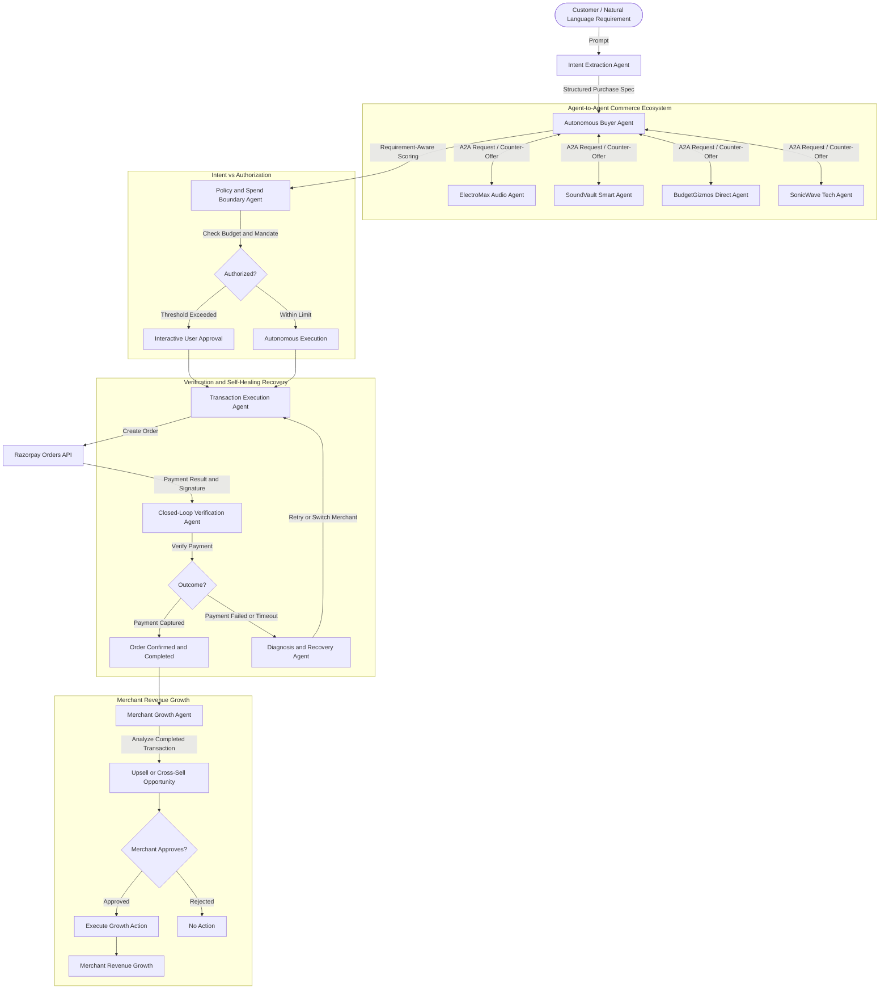

# 💳 Razorpay Agentic Commerce OS

> **Razorpay Agentic Commerce OS**

> **A verifiable, policy-constrained agentic commerce platform that makes merchants transactable by AI buyers and drives merchant revenue growth through intelligent commerce opportunities.**
>
> ** Tehnical Flow:
> Natural Language Intent
→ Multi-Merchant A2A Reasoning
→ Requirement-Aware Scoring
→ Spend Authorization
→ Razorpay Execution
→ Verification & Recovery
→ Growth Opportunities
→ Merchant Approval
→ Revenue Growth**

---

## 🌟 The Core Philosophy

Traditional shopping assistants stop at: *"I recommend Product X."*  
**This system goes the entire distance**: It executes the complete commercial lifecycle, from intent interpretation to Razorpay order creation, payment verification, and autonomous failure recovery.
The commerce loop does not end with a completed purchase.

Completed commerce interactions can generate relevant **upsell and cross-sell opportunities** through the Growth Agent. These recommendations remain merchant-controlled: the merchant reviews and explicitly approves a growth action before execution.

This creates a closed loop:

**AI Buyer Discovery → Transaction → Growth Opportunity → Merchant Approval → Revenue Growth**

### The Three Architectural Pillars:
1. 🧠 **Intelligence & Intent Structuring**: Converts unstructured customer prompts into a verified, multi-attribute Purchase Specification contract.
2. 🤝 **Agent-to-Agent (A2A) Commerce**: Exposes a versioned `POST /api/v1/agent/merchants/{merchant_id}/a2a/query` contract for buyer agents. The bundled merchants run locally as a working protocol simulation; the same structured payload and `MerchantOffer` response can be mapped to external merchant endpoints.
3. 💳 **Safe Transaction Execution with Razorpay**: Strictly separates **Intent** from **Authorization** via policy guardrails, creates authentic Razorpay Orders, verifies cryptographic payment signatures, and triggers self-healing loops upon transaction failures.
4. 📈 **Merchant Revenue Growth**: Uses completed commerce interactions to identify relevant upsell and cross-sell opportunities, with merchant approval required before growth actions are executed.

---

## 🏛️ System Architecture



---

## 🔄 Deterministic Purchase Lifecycle State Machine (FSM)

Money movement cannot rely on non-deterministic LLM loops. This platform enforces a strict Finite State Machine:

```
INTENT_RECEIVED
       ↓
INTENT_VALIDATED
       ↓
MERCHANTS_DISCOVERED
       ↓
OFFERS_RECEIVED
       ↓
PRODUCT_SELECTED
       ↓
AWAITING_AUTHORIZATION  ──[ If Above Threshold ]──► REQUIRES_USER_APPROVAL
       ↓                                                     ↓
   AUTHORIZED ◄──────────────────────────────────────────────┘
       ↓
ORDER_CREATED (Razorpay Order ID Minted)
       ↓
PAYMENT_INITIATED
       ↓
PAYMENT_VERIFIED (Signature & Webhook Validated)
       ↓
PURCHASE_COMPLETED (Closed-Loop Merchant Confirmation)
```

### Self-Healing Failure Branch:
```
PAYMENT_FAILED
       ↓
FAILURE_ANALYSIS (Root-cause diagnosis)
       ↓
RECOVERY_ACTION
       ├── Transient Bank Latency  ──► Fast-track UPI direct rail retry
       ├── Payment Limit Exceeded ──► Alternative payment method switch
       └── Merchant Stock Conflict──► Auto-switch to 2nd-best merchant candidate
       ↓
ORDER_CREATED (Resumed seamlessly without starting over)
```

---

## 🚀 Key Innovations & Differentiators

### 1. Intent $\neq$ Authorization (Policy Boundary Guardrail)
- The user saying *"I need headphones under ₹5,000"* does **not** grant the agent free rein to spend ₹5,000 without guardrails.
- The system enforces explicit user spend mandates (e.g. `max_autonomous_spend: ₹4,000`). Orders below ₹4,000 execute autonomously; orders exceeding the threshold pause at `AWAITING_AUTHORIZATION` for interactive customer sign-off.

### 2. Requirement-Aware Multi-Criteria Scoring
Offers are not sorted by naive lowest price. The Buyer Agent evaluates:
$$\text{Score} = w_f \cdot \text{FeatureMatch} + w_u \cdot \text{UseCaseFit} + w_b \cdot \text{BudgetCompat} + w_d \cdot \text{DeliverySpeed} + w_t \cdot \text{Trust}$$
*(e.g., A ₹3,900 offer lacking Active ANC is heavily penalized against a ₹4,299 or ₹4,800 offer when the user prioritized noise cancellation for daily commuting).*

### 3. Agent-to-Agent Reasoning & Dynamic Negotiation
Merchant agents reason dynamically:
- SoundVault detects a user budget of ₹5,000 on a ₹5,100 flagship model and applies an automatic merchant coupon to offer ₹4,800.
- Out-of-stock items trigger intelligent substitute reasoning rather than a blunt 404.

### 4. Closed-Loop Verification & Self-Healing Recovery
- Verifies Razorpay payment signatures (`HMAC-SHA256`).
- When a payment failure or stock conflict is simulated, the Verification Agent diagnoses the root cause and executes a recovery strategy without losing the customer's state or forcing them to start from scratch.

### 5. Merchant Revenue Growth
The commerce lifecycle does not end with purchase completion.
- The **Growth Agent** analyzes completed commerce interactions to identify relevant upsell and cross-sell opportunities.
- Growth actions remain merchant-controlled:
**Completed Transaction → Growth Opportunity → Merchant Review → Approval → Revenue Growth**
This addresses both sides of agentic commerce: making merchants transactable by AI buyers and helping merchants increase revenue through agent-driven opportunities.

---

## 🛠️ Project Structure

```
RazorPay/
├── backend/
│   ├── app/
│   │   ├── main.py                     # FastAPI entrypoint & CORS
│   │   ├── config.py                   # Environment & Razorpay credentials
│   │   ├── schemas/                    # Pydantic v2 data models
│   │   │   ├── intent.py               # PurchaseIntentSpecification
│   │   │   ├── merchant.py             # A2A schemas & MerchantOffer
│   │   │   ├── policy.py               # SpendPolicy & AuthorizationDecision
│   │   │   └── transaction.py          # RazorpayOrderPayload & RecoveryPlan
│   │   ├── core/
│   │   │   ├── fsm.py                  # Purchase State Machine Engine
│   │   │   └── event_bus.py            # Server-Sent Events (SSE) stream
│   │   ├── agents/                     # Specialized Multi-Agent Network
│   │   │   ├── intent_agent.py         # Intent extraction & normalization
│   │   │   ├── merchant_agents.py      # Multi-Merchant autonomous agents
│   │   │   ├── buyer_agent.py          # Discovery & Requirement-aware scoring
│   │   │   ├── policy_agent.py         # Spend limits & authorization boundary
│   │   │   ├── transaction_agent.py    # Razorpay API client & Order generator
│   │   │   └── verification_agent.py   # Closed-loop verifier & Recovery agent
│   │   │   └── growth_agent.py         # Upsell, cross-sell & merchant revenue opportunities
│   │   ├── services/
│   │   │   ├── razorpay_service.py     # Live & Sandbox Razorpay Orders & Webhooks
│   │   │   └── mock_merchants_db.py    # Multi-merchant product catalogs
│   │   └── api/
│   │       ├── routes_commerce.py      # Commerce orchestration & session routes
│   │       ├── routes_mandates.py      # Spend policy management
│   │       └── routes_webhooks.py      # Razorpay webhook listener
│   └── requirements.txt
├── frontend/                           # Interactive React + Vite Command Center
│   ├── src/
│   │   ├── components/
│   │   │   ├── Navbar.tsx              # Header, session status & quick presets
│   │   │   ├── FsmTracker.tsx          # Real-time FSM progress visualizer
│   │   │   ├── IntentPanel.tsx         # Natural language prompt & parsed spec
│   │   │   ├── A2ADiscoveryPanel.tsx   # Live A2A negotiation & offer feed
│   │   │   ├── ScoringMatrixPanel.tsx  # Multi-factor scoring comparison table
│   │   │   ├── PolicyGuardrailModal.tsx# Mandate configuration & spend limits
│   │   │   ├── RazorpayCheckoutCard.tsx# Order creation, checkout & failure simulator
│   │   │   ├── RecoveryLoopVisualizer.tsx# Failure diagnosis & recovery tree
│   │   │   └── AuditTelemetryLogs.tsx  # Live audit trail & JSON inspector
│   │   ├── lib/api.ts                  # Backend REST & SSE client
│   │   ├── types.ts                    # TypeScript definitions
│   │   └── App.tsx                     # Main Dashboard
│   ├── package.json
│   └── vite.config.ts
├── tests/                              # Pytest suite
│   ├── test_intent.py                  # Intent parsing tests
│   ├── test_buyer_scoring.py           # Scoring algorithm tests
│   ├── test_policy.py                  # Spend guardrail tests
│   ├── test_razorpay_fsm.py            # End-to-end FSM & Razorpay order flow
│   └── test_recovery_loop.py           # Failure simulation & recovery tests
└── README.md
```

---

## ⚡ Quick Start Guide

### 1. Backend Setup
```bash
cd backend
python -m pip install -r requirements.txt
python -m uvicorn app.main:app --reload --port 8000
```
Backend will be live at `http://127.0.0.1:8000` (API Docs at `http://127.0.0.1:8000/docs`).

The backend requires Supabase PostgreSQL. Copy `.env.example` to `.env`, then set
`DATABASE_URL` to the Supabase connection URI from Project Settings > Database.
SQLite is not supported. Use `RAZORPAY_MODE=test` with Razorpay Test Mode keys.
Set `GROQ_API_KEY` to enable Groq-powered intent and merchant agents. The default
model is `llama-3.3-70b-versatile` and the deterministic parser remains the fallback.

Seed the demo catalog and merchant policies into Supabase before starting the app:
```powershell
cd backend
.\.venv\Scripts\python.exe scripts\seed_supabase_demo.py
```
The seed is idempotent and creates four demo merchant accounts, five products, and
four active policies. The demo merchant password is `demo_merchant_password`.

### 2. Frontend Setup
```bash
cd frontend
npm.cmd install
npm.cmd run dev
```
Frontend command center will be live at `http://localhost:5173`. Approved growth campaigns dispatch to `GROWTH_CAMPAIGN_WEBHOOK_URL` when configured; without it, execution is explicitly marked as a local simulation.

### 3. Run Automated Tests
```bash
$env:PYTHONPATH="backend"
python -m pytest tests -v
```

---

## 🎬 Demo Walkthrough Scenarios

### Scenario A: AI Buyer Purchase with Policy Approval

Customer intent → Intent extraction → Multi-merchant A2A discovery → 
Requirement-aware ranking → Policy approval → Razorpay payment → Verification.

**Key guardrail:** A ₹5,000 customer budget does not automatically authorize autonomous spending. Offers above the ₹4,000 mandate require explicit approval.

### Scenario B: Self-Healing Failure Recovery

A simulated payment or stock failure triggers:

`PAYMENT_FAILED → FAILURE_ANALYSIS → RECOVERY_ACTION`

The system diagnoses the failure and can retry or switch to a fallback merchant while preserving the customer's commerce context.

### Scenario C: Merchant Revenue Growth

Completed transaction → Growth opportunity → Merchant approval → Revenue growth.

The Growth Agent identifies relevant upsell and cross-sell opportunities, while the merchant remains in control of approving growth actions.
